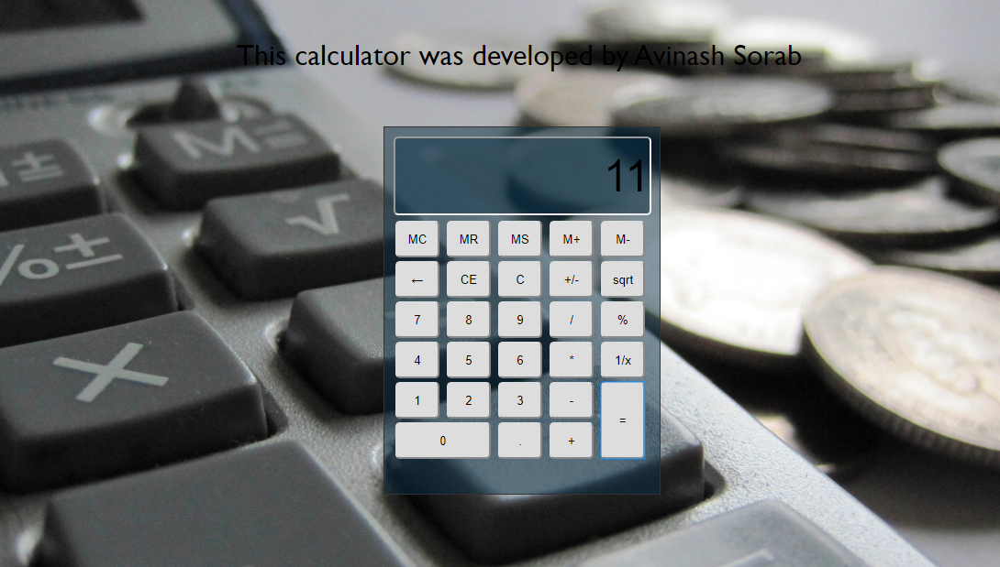

Simple Web Calculator
===============================================================

A simple calculator developed using HTML CSS and JavaScript with memory in it.

---------------------------------------------------------------

|                           |                            |
|---------------------------|----------------------------|
| Developer                 | Avinash Sorab              |
| Languages                 | HTML5, CSS3, JavaScript    |

<!-- TOC -->

- [Usage Instruction](#usage-instruction)
- [Screenshots](#screenshots)

<!-- /TOC -->

## Usage Instruction

- Since this is a static page, there's no need to use a server to run. Just open index.html.

## Screenshots

